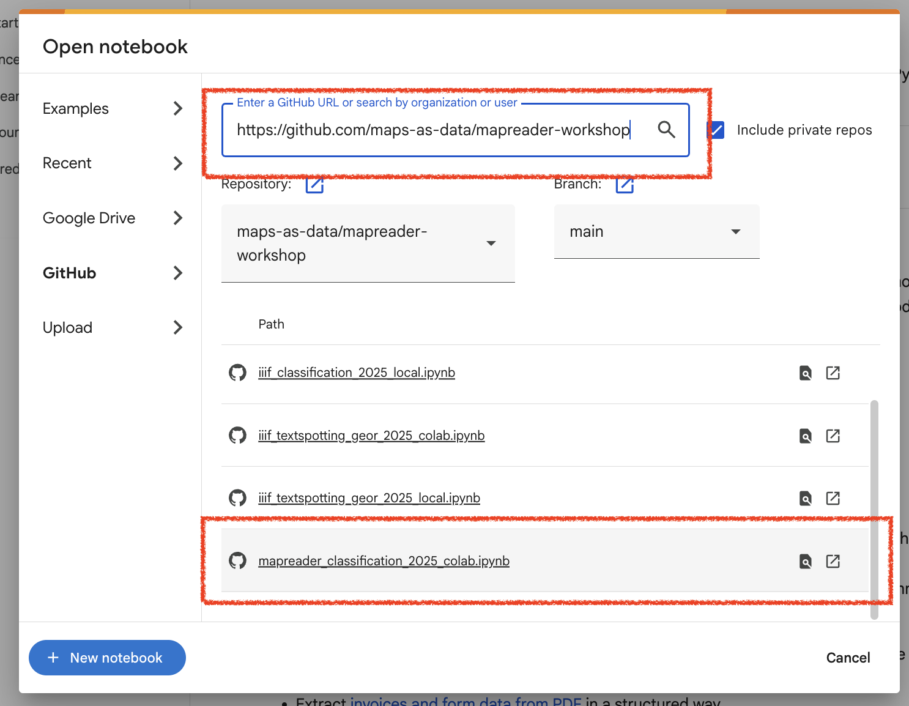
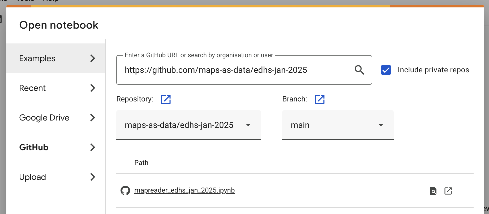

# ADHO DH 2025 MapReader Workshop
July 14, 2025
Lisbon, Portugal

[](https://github.com/maps-as-data/edhs-jan-2025/blob/main/slides.pdf)

[](https://mapreader.readthedocs.io/en/latest)

This repo contains 2 worked examples for using [MapReader](https://github.com/maps-as-data/MapReader).

1. **Patch Classification**: automatically classify regions of historical maps.
2. **Text Spotting**: detect and recognize text on historical maps using a pre-trained text spotting model.

*But first, let's get the notebooks set up.*


## Setup
Follow the instructions below to set up the notebook on Google Colab (**recommended**), in Docker, or locally.

- [Option 1: Google Colab](#option-1-Google-Colab)
- [Detailed instructions for setting up Colab](#detailed-instructions-for-setting-up-Colab)
  - [Optional: Change the runtime type](#optional-change-the-runtime-type)
- [Option 2: Docker](#option-2-docker)
  - [Creating the Docker image](#creating-the-docker-image)
  - [Running the Docker container](#running-the-docker-container)
- [Option 3: Local](#option-3-local)


### Option 1: Google Colab

If you are familiar with Google Colab, you can set up the notebook by following these steps. 

1. In your browser, navigate to [Google Colab](https://colab.research.google.com/).

   An "Open notebook" window should appear automatically. If it doesn't, click `File` > `Open notebook...`.

   

2. In the "Open notebook" window, **click the "GitHub" option**:

   

3. Paste the **URL of this repository into the search bar** and press `Enter`.

    

4. After pressing `Enter`, a list of notebooks in the repository should appear. C**lick on `mapreader_classification_dh_july_2025.ipynb` to open it.**

    

NB: When testing the iiif_text_spotting notebook, you should open the `iiif_textspotting_dh_july_2025.ipynb` notebook instead.

    

5. The notebook should now be opened and look like this:

    

    _Note that Google may display a warning that the notebook is not authored by Google. You can ignore this warning._

    

6. You can now run the notebook by clicking the play button on the left of each cell.

   _Note that the first cell will install all requirements for the notebook to run. It will take some time, and will display some warnings. Those can be ignored. At the bottom, you will see a message that the installation was successful._

    

#### Optional: Change the runtime type

By default, Google Colab uses a CPU runtime. If you want to use a GPU runtime, you can change this by clicking `Runtime` > `Change runtime type` and selecting `GPU` from the `Hardware accelerator` dropdown.

1. Click `Runtime` > `Change runtime type`.

    

2. In the "Change runtime type" window, select `GPU` from the `Hardware accelerator` dropdown. Click `Save` to apply the changes.

    

    After you save the changes, the runtime will be changed to GPU and the core needs to be restarted. Click `OK` to restart the runtime.

    

3. The runtime type should now be changed to GPU.

    

### Option 2: Docker

#### Creating the Docker image

Clone the repository and navigate to the root directory of the repository.

```bash
git clone https://github.com/maps-as-data/workshop-dh2025.git
cd workshop-dh2025
```

To create the Docker image, run the following command:

```bash
docker build -t mapreader-workshop .
```

#### Running the Docker container

To run the Docker container, run the following command:

```bash
docker run -p 8888:8888 --mount source=workshop_outputs,target=/app mapreader-workshop
```

Click the link that appears in the terminal to open the notebook in your browser.

### Option 3: Local

To run the notebook locally, follow the instructions [here](https://mapreader.readthedocs.io/en/latest/getting-started/installation-instructions/index.html) to set up your MapReader python environment.

You can then install the required packages for this notebook by running:

```bash
pip install torch
pip install -r requirements.txt
```

You can then run the notebook by running:

```bash

jupyter notebook mapreader_classification_dh_july_2025.ipynb
```
